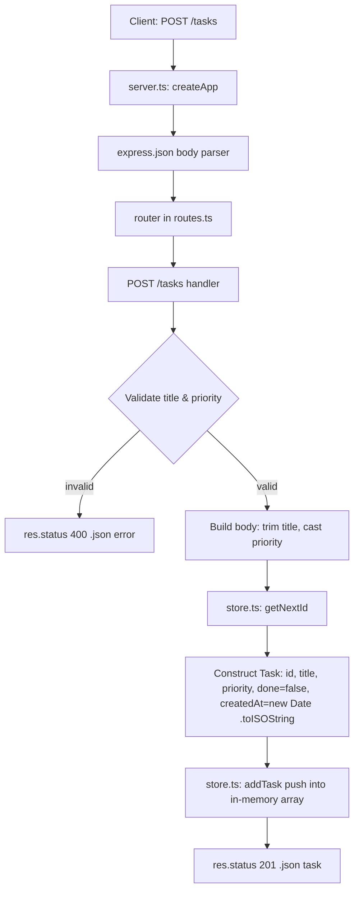
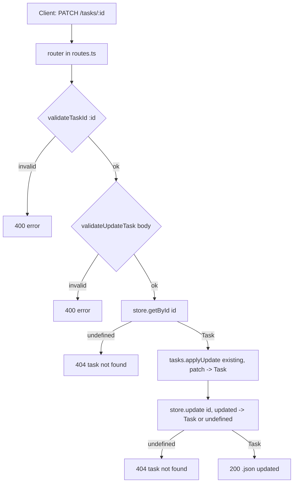

# POST /tasks — Flow, Mixed Responsibilities, and Refactor Plan

## 1. Request flow (as it exists today)



Step-by-step:

1. Client sends `POST /tasks` with JSON body `{ title, priority }`.
2. [src/server.ts](src/server.ts#L5-L9) creates the Express app, registers `express.json()`, and mounts the router.
3. [src/routes.ts](src/routes.ts#L26) receives the request in the `POST /tasks` handler.
4. The handler reads `title` and `priority` from `req.body` typed as `unknown` ([src/routes.ts](src/routes.ts#L27)).
5. It inline-validates three rules: title is a non-empty string, title ≤ 200 chars, priority is an integer 1..5 ([src/routes.ts](src/routes.ts#L29-L37)).
6. It normalizes the input (trim) and re-casts `priority` to `Priority` ([src/routes.ts](src/routes.ts#L39)).
7. It calls `getNextId()` ([src/store.ts](src/store.ts#L15)) and constructs the full `Task` domain object inline, including `createdAt = new Date().toISOString()` ([src/routes.ts](src/routes.ts#L40-L46)).
8. It calls `addTask(task)` ([src/store.ts](src/store.ts#L17-L20)) which mutates the module-level array.
9. It returns `201` with the created task.

## 2. Responsibilities currently mixed together

The `POST /tasks` handler in [src/routes.ts](src/routes.ts#L26-L48) is doing at least four jobs. The table below maps each concern to the code that owns it today.

| Concern | Where it lives now | Problem |
| --- | --- | --- |
| HTTP routing / transport | `router.post('/tasks', …)` in [src/routes.ts](src/routes.ts#L26) | Fine here — but it is entangled with everything below. |
| Input validation & shape checks | [src/routes.ts](src/routes.ts#L29-L37) | Ad-hoc `if` chains inside the handler; not reusable, not unit-testable in isolation, error shape is duplicated inline. |
| Input normalization (trim, cast) | [src/routes.ts](src/routes.ts#L31), [src/routes.ts](src/routes.ts#L39) | Mixed with validation and with domain construction. |
| Domain object construction (assign `id`, `done=false`, `createdAt`) | [src/routes.ts](src/routes.ts#L40-L46) | The route decides what a "new Task" is. Business rules leak into the transport layer. |
| ID generation | `getNextId()` in [src/store.ts](src/store.ts#L23-L25) called from the route | The route knows the store implements identity. It should not. |
| Timestamp generation (`new Date()`) | [src/routes.ts](src/routes.ts#L44) | Non-deterministic clock call inside the route → hard to test without freezing time at the HTTP layer. |
| Persistence | `addTask()` in [src/store.ts](src/store.ts#L17-L20) | OK as a seam, but currently a thin wrapper around a module-level mutable array with no abstraction. |
| Response shaping (status codes, JSON body) | [src/routes.ts](src/routes.ts#L29-L47) | Correct layer, but currently interleaved with validation and construction. |

Secondary observations (not part of the split, but worth noting):

- Validation rules for `title` also exist in the `POST` handler only; there is no shared schema, so `PUT`/`PATCH` (if added) would duplicate them. See [src/routes.ts](src/routes.ts#L29-L34).
- The store exposes its internal array by reference via `getAllTasks()` in [src/store.ts](src/store.ts#L13-L15), which the route + `tasks.ts` rely on. This couples read-side callers to the concrete storage.
- `getNextId()` uses a module-level `let nextId` in [src/store.ts](src/store.ts#L11) — identity assignment is a storage concern that the route currently reaches into.

## 3. Smallest set of changes to separate the layers

Goal: routing stays in `routes.ts`, validation moves out, business logic (build a `Task` from a validated input) moves out, storage stays behind a narrower interface. Keep the public HTTP contract identical.

### 3.1 New files (small, focused)

1. `src/validation.ts` — pure functions.
   - `validateCreateTaskInput(body: unknown): { ok: true; value: CreateTaskInput } | { ok: false; error: string }`.
   - Owns: type checks, trim, length ≤ 200, priority integer 1..5.
   - No Express, no `res`, no `throw` (matches the "return values instead of throwing" preference).

2. `src/tasks.service.ts` (or extend `tasks.ts`) — business logic.
   - `createTask(input: CreateTaskInput, deps: { nextId: () => number; now: () => Date }): Task`.
   - Owns: assembling the `Task` (sets `done=false`, `createdAt`, assigns `id` via `deps.nextId`).
   - Clock and id are injected → deterministic unit tests without HTTP.

### 3.2 Changes to existing files

3. `src/store.ts`
   - Keep `addTask`, `getAllTasks`, `getNextId` but treat them as the storage port.
   - Optionally group them into a `TaskStore` object literal (`{ add, list, nextId }`) so callers depend on one shape instead of three loose exports. This is the minimal step toward a swap-in persistent store later.

4. `src/routes.ts` — `POST /tasks` becomes a thin adapter:
   ```
   const parsed = validateCreateTaskInput(req.body);
   if (!parsed.ok) return res.status(400).json({ error: parsed.error });
   const task = createTask(parsed.value, { nextId: getNextId, now: () => new Date() });
   addTask(task);
   return res.status(201).json(task);
   ```
   The route now only: parses HTTP → delegates → maps result to status + JSON.

5. `src/routes.ts` — `GET /tasks/search` (flagged in the file as a planted ReDoS gap in [src/routes.ts](src/routes.ts#L51-L57)) is out of scope for this refactor but should get the same treatment: validation of `q` in `validation.ts`, search logic in `tasks.ts`.

### 3.3 Layer map after the change

| Layer | File | Responsibility |
| --- | --- | --- |
| Transport / routing | `src/routes.ts` | URL → call service → status + JSON. No business rules. |
| Validation | `src/validation.ts` | `unknown` → typed `CreateTaskInput` or error string. |
| Domain / business logic | `src/tasks.ts` (or `tasks.service.ts`) | Build `Task` from `CreateTaskInput`, apply invariants (`done=false`, timestamps, id assignment via injected port). |
| Storage | `src/store.ts` | `add`, `list`, `nextId`. In-memory today, replaceable later. |
| Composition root | `src/server.ts` | Wire router; unchanged. |

### 3.4 Why this is the *smallest* useful split

- One new pure-function module (`validation.ts`) — no framework, trivially unit-testable.
- One new pure-function (`createTask`) in an existing domain file — removes clock and id from the route without introducing a class hierarchy or DI container.
- `store.ts` and `server.ts` do not need to change to unlock the split; grouping into a `TaskStore` object is optional and can follow later.
- No change to routes, response shapes, or status codes → no API contract change, existing tests in [src/tasks.test.ts](src/tasks.test.ts) keep passing.

### 3.5 Test seams unlocked

- `validateCreateTaskInput` — table-driven tests for every 400 case, no Express needed.
- `createTask` — pass `nextId: () => 42, now: () => new Date('2026-01-01Z')` and assert the exact `Task` shape.
- Route test — only needs to assert "400 on bad input" and "201 + body echoes service result"; the service and validator can be stubbed.

## 4. Update-by-id — how it should flow and what the store is missing

Target endpoint: `PATCH /tasks/:id` (partial update of `title`, `priority`, and/or `done`). The same layering used for `POST /tasks` in §3 applies: transport → validation → domain → storage.

### 4.1 Intended request flow



Contract per layer:

| Layer | New / changed function | Responsibility |
| --- | --- | --- |
| Transport | `PATCH /tasks/:id` in [src/routes.ts](src/routes.ts) | Parse id + body, map errors to 400/404, return 200 with updated task. |
| Validation | `validateUpdateTask(body): { ok: true; value: UpdateTaskInput } \| { ok: false; error }` in [src/validation.ts](src/validation.ts) | Accept a partial `{ title?, priority?, done? }`. Reject empty patches, non-string titles, out-of-range priorities, non-boolean `done`. Reuses the same title/priority rules as `validateCreateTask` in [src/validation.ts](src/validation.ts#L11-L25). |
| Domain | `applyUpdate(existing: Task, patch: UpdateTaskInput): Task` in [src/tasks.ts](src/tasks.ts) | Pure. Returns a **new** `Task` with patched fields; never mutates `existing`. Keeps `id` and `createdAt` immutable. |
| Storage | `getById(id)` and `update(id, task)` in [src/store.ts](src/store.ts) | Look up and replace by id; return `undefined` if not found. No domain logic. |

### 4.2 What the store is missing today

The store in [src/store.ts](src/store.ts#L1-L30) exposes only `add`, `list`, and `nextId`. That surface is enough for create + read-all, but it forces every write-by-id path to reach into the array itself. The gaps:

| # | Gap | Where it hurts today | What update-by-id needs |
| --- | --- | --- | --- |
| 1 | No `getById(id): Task \| undefined` | `completeTask` in [src/tasks.ts](src/tasks.ts#L34-L41) has to call `getAllTasks().find(...)` — the domain layer is doing storage lookups. | A single lookup seam so the route/service asks the store, not the array. |
| 2 | No `update(id, task): Task \| undefined` (or `replace` / `patch`) | Same `completeTask` mutates the found task in place — this is a write with no store method behind it. | Explicit replace-by-id that returns the stored task (or `undefined` for 404). |
| 3 | `getAllTasks()` returns the internal array by reference ([src/store.ts](src/store.ts#L13-L15)) | Callers can mutate stored tasks without going through the store. `completeTask` already does. | Either return a defensive copy, or make `Task` treated as immutable and require all writes to go through `update`. |
| 4 | No id → task index | `find` is O(n) on every lookup ([src/tasks.ts](src/tasks.ts#L34)). | A `Map<number, Task>` (or equivalent) so `getById` and `update` are O(1). |
| 5 | No "not found" signal from writes | Today "not found" is inferred from a `find` returning `undefined` in the domain layer. | `update` returning `undefined` gives the route a clean 404 path without leaking storage details. |
| 6 | Grouped `taskStore` object omits reads/lookups | [src/store.ts](src/store.ts#L27-L30) exposes `{ add, list, nextId }` only. | Extend to `{ add, list, nextId, getById, update }` so routes depend on one port. |

### 4.3 Smallest change to close the gaps

1. In [src/store.ts](src/store.ts):
   - Add `getById(id: number): Task | undefined`.
   - Add `update(id: number, task: Task): Task | undefined` that replaces the entry and returns it, or returns `undefined` when the id is unknown.
   - Extend `taskStore` to include both.
   - Optional follow-up: back the store with a `Map<number, Task>` for O(1) access; keep `list()` returning an array for existing callers.

2. In [src/types.ts](src/types.ts): add `UpdateTaskInput = Partial<Pick<Task, 'title' | 'priority' | 'done'>>`. `id` and `createdAt` are not patchable.

3. In [src/validation.ts](src/validation.ts): add `validateUpdateTask` reusing the title/priority checks; require at least one field present.

4. In [src/tasks.ts](src/tasks.ts): add pure `applyUpdate(existing, patch)`; refactor `completeTask` to `applyUpdate(existing, { done: true })` + `taskStore.update(id, updated)` so it stops mutating through `getAllTasks()`.

5. In [src/routes.ts](src/routes.ts): add the `PATCH /tasks/:id` handler that follows the flow in §4.1 — no business logic, just validate → lookup → apply → store → respond.

### 4.4 Invariants the update path must preserve

- `id` and `createdAt` are never changed by an update.
- Validation rules for `title` and `priority` are identical to create (single source in `validation.ts`).
- `applyUpdate` is pure; the only mutation happens inside `store.update`.
- An update to a missing id returns 404, never 200 with a partially-constructed task.
